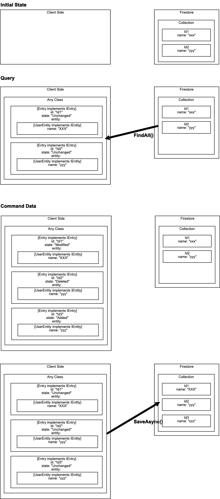

# firestore-entity-framework
operate firestore data such as entity framework.
I'm in trouble with syncing data between client side and firestore.
That's why, I made this based on Entity Framework of .Net.

some issue is remaining
* transaction across colleition.
* collection structure is not considered.
etc.. 

# Image

